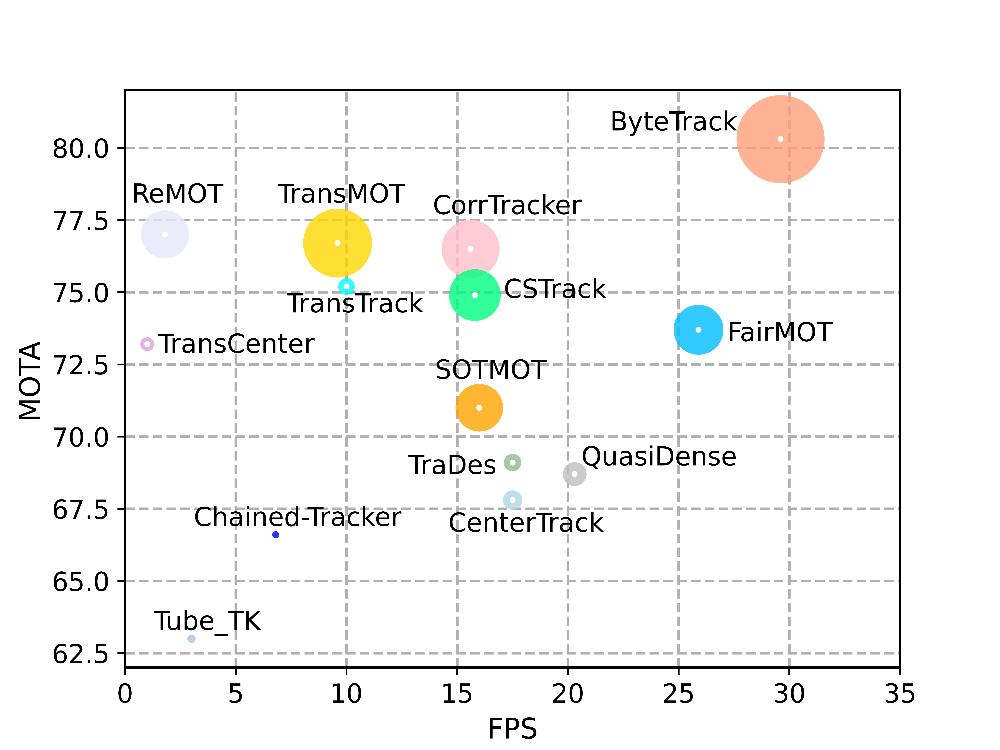

# ByteTrack with LLM Integration

This is a modified version of ByteTrack that integrates Large Language Model (LLM) capabilities for natural language-based target selection in multi-object tracking.

#### ByteTrack is a simple, fast and strong multi-object tracker enhanced with LLM-based target identification.

<p align="center"></p>

> Based on [**ByteTrack: Multi-Object Tracking by Associating Every Detection Box**](https://arxiv.org/abs/2110.06864)
> 
> Original authors: Yifu Zhang, Peize Sun, Yi Jiang, Dongdong Yu, Fucheng Weng, Zehuan Yuan, Ping Luo, Wenyu Liu, Xinggang Wang
> 
> *[arXiv 2110.06864](https://arxiv.org/abs/2110.06864)*

## Key Features

- **LLM-based Target Selection**: Use natural language prompts to identify and track specific targets
- **Automatic Crop Generation**: Extracts person crops from the first frame for LLM analysis
- **Selective Tracking**: Focuses on the target identified by the LLM prompt

## Quick Start

### Prerequisites
1. Install Ollama and pull the vision model:
   ```bash
   ollama pull qwen2.5vl
   ```

2. Download pretrained ByteTrack model:
   ```bash
   mkdir -p pretrained
   # Download bytetrack_x_mot17.pth.tar to pretrained/
   ```

3. Place your video in the `videos/` directory (e.g., `videos/test.mp4`)

### Usage

#### Simple Tracking with LLM Prompt
Use `run.py` to track a specific target based on natural language description:

```bash
python run.py --prompt "找出穿粉紅色衣服的人"
```

The system will:
1. Extract crops of all detected persons from the first frame
2. Use the LLM (qwen2.5vl) to identify the target matching your prompt
3. Track only the identified target throughout the video

#### Batch Processing
Process multiple videos without LLM filtering:

```bash
python run_batch.py
```

#### Direct Tracking
Use the tracking script directly with more options:

```bash
python tools/demo_track.py video \
  -f exps/example/mot/yolox_x_mix_det.py \
  -c pretrained/bytetrack_x_mot17.pth.tar \
  --fp16 --fuse --save_result \
  --path videos/test.mp4 \
  --track_thresh 0.3 \
  --min_box_area 5 \
  --prompt "找出穿粉紅色衣服的人"
```

### Tracking Parameters
- `--prompt`: Natural language description of the target to track
- `--track_thresh`: Tracking confidence threshold (default: 0.5)
- `--min_box_area`: Filter out tiny boxes below this area (default: 10)
- `--target_id`: Manually specify a track ID to follow (skips LLM, use -1 for all)
- `--match_thresh`: Matching threshold for tracking (default: 0.8)
- `--track_buffer`: Frames to keep lost tracks (default: 30)

## Tracking performance
### Results on MOT challenge test set
| Dataset    |  MOTA | IDF1 | HOTA | MT | ML | FP | FN | IDs | FPS |
|------------|-------|------|------|-------|-------|------|------|------|------|
|MOT17       | 80.3 | 77.3 | 63.1 | 53.2% | 14.5% | 25491 | 83721 | 2196 | 29.6 |
|MOT20       | 77.8 | 75.2 | 61.3 | 69.2% | 9.5%  | 26249 | 87594 | 1223 | 13.7 |

### Visualization results on MOT challenge test set
   
   

## Installation

### Step 1: Install Dependencies
```bash
pip3 install -r requirements.txt
python3 setup.py develop
```

### Step 2: Install Additional Tools
```bash
pip3 install cython
pip3 install 'git+https://github.com/cocodataset/cocoapi.git#subdirectory=PythonAPI'
pip3 install cython_bbox
```

### Step 3: Install Ollama
Follow the instructions at [ollama.ai](https://ollama.ai) to install Ollama, then:
```bash
ollama pull qwen2.5vl
```

### Step 4: Download Pretrained Model
Download the ByteTrack pretrained model and place it in the `pretrained/` directory:
- [bytetrack_x_mot17.pth.tar](https://drive.google.com/file/d/1P4mY0Yyd3PPTybgZkjMYhFri88nTmJX5/view?usp=sharing)

## How It Works

1. **First Frame Analysis**: When processing a video, the system extracts crops of all detected persons from the first frame and saves them to the `crops/` directory with the naming format `i{track_id}_f{frame_id}.jpg`

2. **LLM Evaluation**: The `LLM.py` script processes these crops using Ollama's vision model (qwen2.5vl), evaluating each person against your natural language prompt

3. **Target Selection**: The LLM identifies which person matches the description and returns their track_id

4. **Filtered Tracking**: The rest of the video only tracks and displays the identified target

## Output

Results are saved to `YOLOX_outputs/yolox_x_mix_det/track_vis/{timestamp}/`:
- **Video file**: `{video_name}.mp4` with tracking visualization
- **Tracking data**: `{timestamp}.txt` in MOT format (frame, id, x, y, w, h, score)
- **Crops**: Saved in `crops/` directory


## Components

### Main Scripts

- **`run.py`**: Simple wrapper to run tracking with LLM prompt
- **`run_batch.py`**: Batch process multiple videos without LLM filtering
- **`LLM.py`**: Standalone script that queries the LLM to identify targets from crops
- **`tools/demo_track.py`**: Core tracking script with LLM integration

### Key Files

- **`crops/`**: Directory where person crops are saved for LLM analysis
- **`videos/`**: Place your input videos here
- **`pretrained/`**: Directory for ByteTrack model weights
- **`YOLOX_outputs/`**: Output directory for tracking results

## Supported Models

This implementation uses the ByteTrack X model for best accuracy. Download:

| Model    |  MOTA | IDF1 | IDs | FPS |
|------------|-------|------|------|------|
|bytetrack_x_mot17 [[google]](https://drive.google.com/file/d/1P4mY0Yyd3PPTybgZkjMYhFri88nTmJX5/view?usp=sharing), [[baidu(code:ic0i)]](https://pan.baidu.com/s/1OJKrcQa_JP9zofC6ZtGBpw) | 90.0 | 83.3 | 422 | 29.6 |


## Example Use Cases

```bash
# Track person wearing pink clothes
python run.py --prompt "找出穿粉紅色衣服的人"

# Track person with red shirt
python run.py --prompt "Find the person wearing a red shirt"

# Track person with specific characteristics
python run.py --prompt "Track the person wearing glasses and a blue jacket"
```

## Troubleshooting

### LLM Connection Issues
- Ensure Ollama is running: `ollama serve`
- Verify the model is installed: `ollama list`
- Check the API endpoint in `LLM.py` (default: `http://localhost:11434/api/generate`)

### No Target Found
- Check that the target is visible in the first frame
- Verify crop images are saved in `crops/` directory
- Try adjusting the prompt to be more specific or more general
- Manually review the LLM output in the console

### Tracking Performance
- Adjust `--track_thresh` to change detection confidence threshold
- Modify `--min_box_area` to filter small detections
- Use `--match_thresh` to control matching sensitivity

## Original ByteTrack Citation

```
@article{zhang2022bytetrack,
  title={ByteTrack: Multi-Object Tracking by Associating Every Detection Box},
  author={Zhang, Yifu and Sun, Peize and Jiang, Yi and Yu, Dongdong and Weng, Fucheng and Yuan, Zehuan and Luo, Ping and Liu, Wenyu and Wang, Xinggang},
  booktitle={Proceedings of the European Conference on Computer Vision (ECCV)},
  year={2022}
}
```

## Acknowledgement

This project builds upon:
- [ByteTrack](https://github.com/ifzhang/ByteTrack) - Base tracking framework
- [YOLOX](https://github.com/Megvii-BaseDetection/YOLOX) - Object detection model
- [Ollama](https://ollama.ai) - LLM inference engine
- [Qwen2.5-VL](https://github.com/QwenLM/Qwen2.5-VL) - Vision-language model

